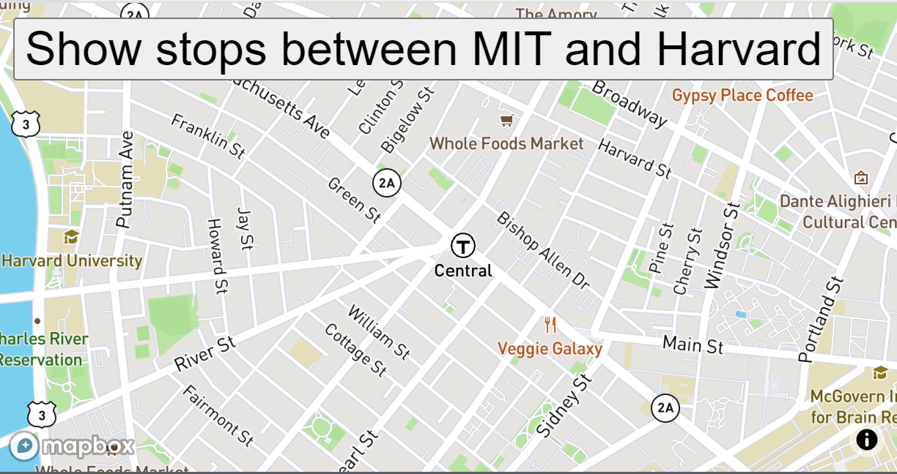

# Bus Tracker Exercise

## Description

This exercise uses maps and public bus data to track bus stops on the map. You will see a zoomed in map on Boston. There will be markers that represent stops that the bus makes from MIT and Harvard. You will also see the bus moving from MIT to Boston on its route.

## How to Run

Save all of the files in this repository to a folder on your computer. If you need to make any changes, you can do so using an editor like vs code. Open a blank browser and drag the index over to it. 

## Licenses

MIT License
